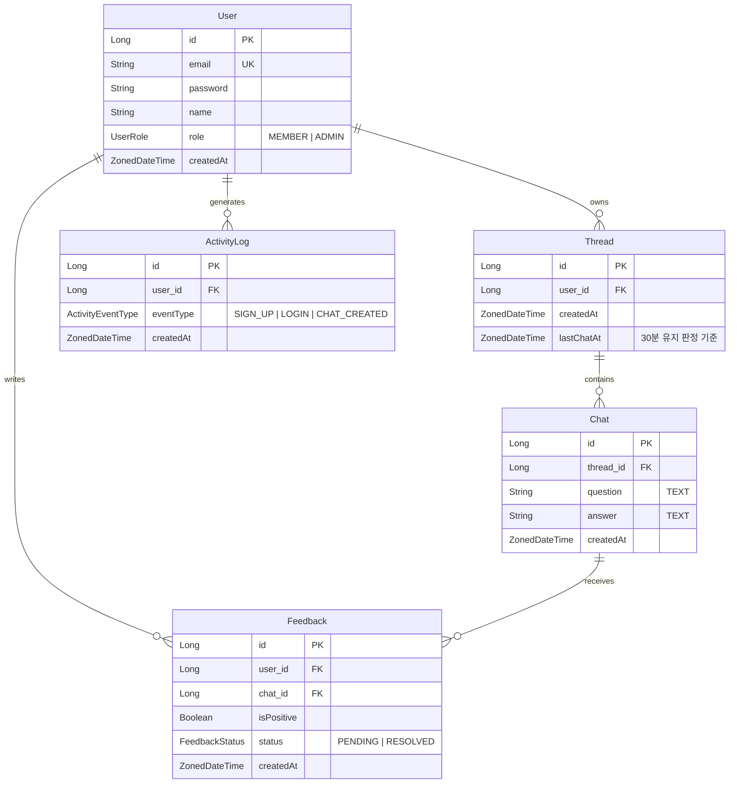

# AI 챗봇 서비스 API

VIP onboarding 팀 고객사 시연용으로 시작해, 지속적 확장을 전제로 개발한 챗봇 백엔드 API입니다.
Kotlin + Spring Boot 기반이며 OpenAI Chat Completions를 활용합니다.

---

## 기술 스택

| 분류 | 선택                                     |
|---|----------------------------------------|
| 언어 | Kotlin 2.1, JVM 17                     |
| 프레임워크 | Spring Boot 3.4                        |
| 빌드 | Gradle Kotlin DSL                      |
| 인증 | Spring Security + JWT (jjwt 0.12)      |
| ORM | Spring Data JPA + Hibernate            |
| DB (dev) | H2 in-memory (`MODE=PostgreSQL`)       |
| DB (prod) | PostgreSQL                             |
| AI | OpenAI API (Chat Completions, 스트리밍 지원) |

---

## 프로젝트 구조

```
src/main/kotlin/com/sionic/app/
├── SionicApplication.kt
├── config/         # Security, OpenAI RestClient, JPA 설정
├── security/       # JwtTokenProvider, JwtAuthenticationFilter, UserDetailsService
├── exception/      # 도메인 예외 + 전역 핸들러
└── domain/
    ├── user/       # 회원가입·로그인·JWT 발급
    ├── chat/       # Thread/Chat, OpenAI 연동, SSE 스트리밍
    ├── feedback/   # 대화별 피드백 CRUD + 상태 변경
    └── report/     # 활동 로그·CSV 보고서 (관리자 전용)
```

패키지는 도메인 단위로 분리했고, 도메인 간 참조는 Service 레이어를 통해서만 이뤄집니다.

각 도메인의 상세 스펙·ERD·API 명세는 `docs/{도메인}/` 아래에 있습니다.

---

## 데이터 모델 (전체 ERD)



**주요 제약**

- `Feedback`은 `(user_id, chat_id)`에 UNIQUE 제약 — 한 유저는 하나의 chat에 하나의 피드백만 생성 가능. 반면 하나의 chat에는 서로 다른 유저의 피드백 N개가 존재 가능.
- `Thread.lastChatAt`은 스레드 재사용 판정(마지막 chat으로부터 30분)에 사용되는 파생 컬럼이며, chat 생성 시점에 갱신됩니다.
- 각 도메인의 상세 ERD는 `docs/{도메인}/erd.md`를 참조하세요.

---

## API 요약

| 메서드 | 경로 | 설명 | 권한 |
|---|---|---|---|
| POST | `/api/auth/signup` | 회원가입 | 공개 |
| POST | `/api/auth/login` | 로그인 (JWT 발급) | 공개 |
| POST | `/api/chats` | 대화 생성 (`isStreaming`, `model` 옵션) | 인증 |
| GET | `/api/threads` | 대화 목록 (스레드 그룹화, 페이지네이션) | 인증 / 관리자는 전체 |
| DELETE | `/api/threads/{id}` | 스레드 삭제 | 본인만 |
| POST | `/api/feedbacks` | 피드백 생성 | 대화 소유자 / 관리자 |
| GET | `/api/feedbacks` | 피드백 목록 (긍/부정 필터, 페이지네이션) | 인증 / 관리자는 전체 |
| PATCH | `/api/feedbacks/{id}/status` | 피드백 상태 변경 | 관리자 |
| GET | `/api/reports/activity` | 최근 24h 활동 집계 | 관리자 |
| GET | `/api/reports/chats.csv` | 최근 24h 대화 CSV 보고서 | 관리자 |

회원가입·로그인을 제외한 모든 엔드포인트는 `Authorization: Bearer <JWT>`가 필요합니다.

---

# 의사결정

## 1. 과제를 분석 방법

1. 데이터 모델 우선 정리
   각 기능이 요구하는 데이터 구성 요소를 먼저 훑어보고
   회원-스레드-대화-피드백 간의 관계를 간단히 손그림을 통해 ERD로 그려 전체 구조를 파악했습니다.
   전체적인 구조는 완료되었으므로 세부적인 데이터 모델은 docs폴더에 있는 erd 파일들을 만들면서 구성했습니다.

2. 모호한 요구사항 식별 및 해석 기준 수립
   문서에 명시되지 않았거나 여러 해석이 가능한 부분들을 정리했습니다.
   해당 기능에 대한 설명을 Claude code에 주면 애매한 부분의 경우 저와 대화를 하면서 더 구체적으로 요구사항을 만들어서 spec.md 파일에 포함시켰습니다.

3. 과도한 엔지니어링 방지
   해당 과제는 시간이 많지 않기 때문에 과도한 코딩을 Claude code가 하면 오히려 롤백하는 시간이 많아집니다. 그래서 erd.md, spec.md를 
   참고해 반드시 필요한 API와 정확한 스펙만을 다루도록 api.md 파일을 각 기능별로 만들었습니다. 

## 2. AI 활용 방법

AI(Claude Code)를 코드 생성 도구가 아니라 **설계 파트너**로 사용했습니다. 구현은 AI에 맡기고 저는 특히 문서 설계 과정에 많은 시간을 투자했습니다.
AI가 설계 문서에 대해서 어떤 제안을 하면 저는 그 문서를 판단하고 수정을 요청하는 SDD 방식을 사용했습니다.

### AI 활용에서의 어려움

AI는 문서를 빠르게 구조화하는 데는 도움이 됐지만 요구사항에 명시되지 않은 모호한 지점에 대해서는 명확한 정답을 주기보다 여러 가능성을 나열하는 경우가 많았습니다.
결국 이런 지점들은 AI의 답을 참고하되 어떤 선택이 이 프로젝트의 의도에 더 부합하는지는 제가 직접 판단해야 했습니다.

## 3. 구현하기 가장 어려웠던 기능 — SSE 스트리밍의 스레드 모델과 취소 전파

### 왜 어려웠는가

챗봇 API에서 `isStreaming=true`는 단순히 응답을 조각내서 보내는 문제가 아니라 **한 요청이 수십 초 동안 살아있는 상태에서 클라이언트/서버/외부 API 세 축이 어떻게 정합성을 유지하느냐** 문제입니다. 초기 구현에서 다음 4개 지점 모두가 잠재적 결함이었습니다.

- 스레드 풀 모델 (요청당 얼마나 자원을 물고 있나)
- Emitter 타임아웃 (좀비 커넥션이 얼마나 오래 사는가)
- 클라이언트 disconnect 시 upstream OpenAI 스트림 취소 (토큰 낭비 방지)
- 완료 콜백에서의 DB 저장 정책 (부분 답변 저장 여부)

### 후보 비교와 최종 선택

**대안 A. 최소 개선** — bounded pool + emitter 타임아웃 + 취소 플래그 + 저장 스킵
- 코드 변경 최소, MVC 스택 유지
- 여전히 요청당 스레드 하나 점유(blocking read)

**대안 B. WebFlux/WebClient 이관** — non-blocking 스트리밍, Reactor로 취소 자동 전파
- 스레드 점유 없이 수백~수천 동시 스트리밍 가능
- 스택 일부만 reactive라 스타일 혼재, 난이도 높음

**대안 C. WebFlux 전면 이관**
- 일관성, 확장성 최상
- 시연 규모 대비 오버엔지니어링

**대안 D. Kotlin Coroutines + Flow**
- 명령형 스타일 유지하며 non-blocking
- Spring MVC와의 통합 설정 필요

**최종 결정: A**

본질적으로 옳은 것은 B지만 지금 발생 중인 **현실적인 손해**가 무엇인지 다시 봤습니다.

- 현 규모에서 스레드 수 부족은 아직 문제가 아님
- 반면 **취소 미전파로 인한 OpenAI 토큰 낭비 + 유령 chat 저장**은 지금도 발생 가능한 현실적인 손해
- 즉 지금 우선순위는 스레드 모델의 근본 개선이 아니라 **잘못된 종료 시나리오에서 자원과 데이터를 새게 두지 않는 것**

이 판단으로 A를 골랐고, 다음 요소를 도입했습니다 ([`ChatService.kt`](./src/main/kotlin/com/sionic/app/domain/chat/ChatService.kt), [`OpenAiClient.kt`](./src/main/kotlin/com/sionic/app/domain/chat/OpenAiClient.kt)).

- `Executors.newCachedThreadPool()` → 상한 있는 `FixedThreadPool` + 명명된 daemon 스레드(`chat-stream-N`, 스레드 덤프에서 식별 용이)
- `SseEmitter(-1L)` → `application.yml`의 `app.chat.stream.timeout-ms` 기반 유한 타임아웃
- `AtomicBoolean cancelled` + `emitter.onTimeout/onError/onCompletion`에서 `set(true)` → `OpenAiClient.stream`이 매 라인마다 확인하고 즉시 루프 이탈 → `bufferedReader.use`가 닫히면서 upstream 연결 해제
- 취소된 요청은 부분 답변을 chat/activity log에 저장하지 않음(**완전 취소** 정책, 유령 데이터 방지)
- pool 소진 시 `RejectedExecutionException`을 `emitter.completeWithError`로 클라이언트에 명확히 전달
- `@PreDestroy`로 앱 종료 시 executor를 최대 10초 graceful shutdown

### 이 결정에서 드러난 판단


"WebFlux로 다 갈아엎자"라는 흔한 반응을 참는 것이 이 문제의 핵심이었습니다. **본질적으로 옳은 해법(B)과 지금 이 프로젝트가 감당할 수 있는 해법(A)이 다르다**는 것을 확인하고 B로 가기 위해 도움이 되는(`isCancelled` 콜백 시그니처, 타임아웃 설정 externalize)까지 만들어두는 것으로 절충했습니다.

### 한계

- 취소는 다음 chunk 도착 시점에 적용됩니다. blocking `read()`가 다음 chunk를 받아야 취소 플래그를 체크할 수 있기 때문입니다. OpenAI는 스트리밍 중 초당 여러 chunk를 보내므로 실질 지연은 무시할 수준이지만 완벽한 즉시 취소는 B로 가야 얻어집니다.

---

## 개발 원칙

이 저장소의 개발 원칙은 [`CLAUDE.md`](./CLAUDE.md)에 정리돼 있습니다. 핵심 규칙 다섯 가지:

1. 코딩 전에 먼저 생각한다 — 해석이 여럿이면 조용히 하나 고르지 않고 제시하고 선택
2. 최소 코드 원칙 — 지금 필요한 만큼만
3. 비목표 우선 — 범위 밖 파일·엔드포인트·기능을 만들지 않음
4. 외과적 변경 — 건드려야 하는 것만
5. 보안 우선 — 회원가입/로그인 외 전 엔드포인트 JWT

---

## 브랜치 히스토리

`master`에 4개의 feature 브랜치와 1개의 성능 개선 브랜치가 순차 병합돼 있습니다.

```
feat/user-auth   → 회원가입·로그인·JWT
feat/chat        → Thread/Chat, OpenAI 연동, SSE 스트리밍
feat/feedback    → 피드백 CRUD, 상태 변경
feat/report      → 활동 로그, CSV 보고서
perf/chat-openai → SSE 스트리밍 안정성 개선 (위 3번 참조)
```

각 도메인 브랜치는 `docs/{도메인}/spec.md`, `erd.md`, `api.md`가 먼저 커밋된 뒤 구현이 이어지도록 커밋 순서를 정리했습니다.
