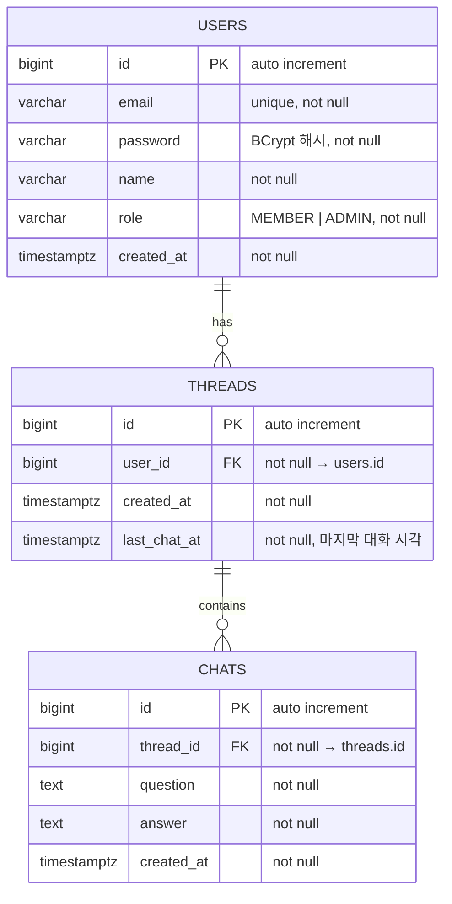

# ERD — 대화(Chat) 관리

- **브랜치**: `feat/chat`
- **작성일**: 2026-07-14

---

## 다이어그램

---

## 테이블 정의

### threads

| 컬럼 | DB 타입 | Kotlin 타입 | 제약 | 설명 |
|---|---|---|---|---|
| id | `BIGINT` | `Long` | PK, auto increment | 식별자 |
| user_id | `BIGINT` | `Long` | NOT NULL, FK → users.id | 소유 유저 |
| created_at | `TIMESTAMPTZ` | `ZonedDateTime` | NOT NULL | 스레드 생성 일시 |
| last_chat_at | `TIMESTAMPTZ` | `ZonedDateTime` | NOT NULL | 마지막 대화 생성 일시 (30분 분기 판단용) |

### chats

| 컬럼 | DB 타입 | Kotlin 타입 | 제약 | 설명 |
|---|---|---|---|---|
| id | `BIGINT` | `Long` | PK, auto increment | 식별자 |
| thread_id | `BIGINT` | `Long` | NOT NULL, FK → threads.id | 소속 스레드 |
| question | `TEXT` | `String` | NOT NULL | 사용자 질문 |
| answer | `TEXT` | `String` | NOT NULL | AI 생성 답변 |
| created_at | `TIMESTAMPTZ` | `ZonedDateTime` | NOT NULL | 대화 생성 일시 |

---

## 인덱스

| 인덱스명 | 테이블 | 컬럼 | 종류 | 목적 |
|---|---|---|---|---|
| `threads_pkey` | threads | `id` | PK | 기본 조회 |
| `threads_user_id_idx` | threads | `user_id` | INDEX | 유저별 스레드 조회 |
| `threads_user_last_chat_idx` | threads | `user_id, last_chat_at DESC` | INDEX | 30분 분기 판단 시 최신 스레드 조회 |
| `chats_pkey` | chats | `id` | PK | 기본 조회 |
| `chats_thread_id_idx` | chats | `thread_id` | INDEX | 스레드별 대화 조회 |

---

## 설계 결정 기록 (Decision Log)

| # | 질문 | 선택 | 선택지 후보 | 이유 |
|---|---|---|---|---|
| 1 | `last_chat_at` 저장 위치 | `threads` 테이블에 비정규화 컬럼으로 보관 | ① threads에 컬럼 ② chats에서 MAX(created_at) 쿼리 | 대화 생성 시마다 쿼리 없이 O(1)로 30분 분기 판단 가능. 쓰기 빈도가 낮아 업데이트 부담 미미. |
| 2 | question/answer 컬럼 타입 | `TEXT` (가변 길이 무제한) | ① VARCHAR(N) ② TEXT | AI 답변 길이가 모델·프롬프트에 따라 가변적이므로 길이 제한 불필요. |
| 3 | 스레드 삭제 방식 | Hard delete + chats cascade | ① Hard delete + cascade ② Soft delete (deleted_at 컬럼) | 시연 범위에서 삭제 이력 복구 요구사항 없음. Soft delete는 조회 쿼리 복잡도와 인덱스 부담을 추가함. |
| 4 | 스레드 제목 컬럼 | 없음 | ① 없음 ② title VARCHAR | spec.md Decision Log #2 참조. |
