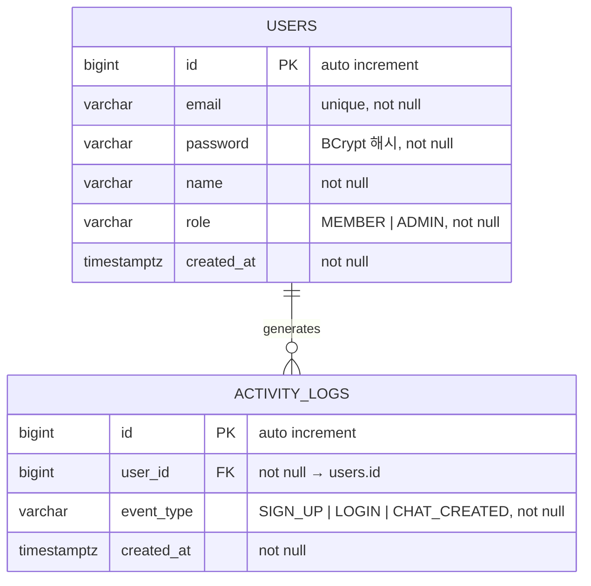

# ERD — 분석 및 보고

- **브랜치**: `feat/report`
- **작성일**: 2026-07-14

---

## 다이어그램

---

## 테이블 정의

### activity_logs

| 컬럼 | DB 타입 | Kotlin 타입 | 제약 | 설명 |
|---|---|---|---|---|
| id | `BIGINT` | `Long` | PK, auto increment | 식별자 |
| user_id | `BIGINT` | `Long` | NOT NULL, FK → users.id | 이벤트를 발생시킨 유저 |
| event_type | `VARCHAR(20)` | `EventType (enum)` | NOT NULL | `SIGN_UP`, `LOGIN`, `CHAT_CREATED` |
| created_at | `TIMESTAMPTZ` | `ZonedDateTime` | NOT NULL | 이벤트 발생 일시 |

---

## 인덱스

| 인덱스명 | 테이블 | 컬럼 | 종류 | 목적 |
|---|---|---|---|---|
| `activity_logs_pkey` | activity_logs | `id` | PK | 기본 조회 |
| `activity_logs_created_at_idx` | activity_logs | `created_at DESC` | INDEX | 24시간 내 이벤트 범위 스캔 |
| `activity_logs_event_type_created_at_idx` | activity_logs | `event_type, created_at DESC` | INDEX | 이벤트 타입별 카운트 |

---

## 설계 결정 기록 (Decision Log)

| # | 질문 | 선택 | 선택지 후보 | 이유 |
|---|---|---|---|---|
| 1 | user_id nullable 여부 | NOT NULL | ① NOT NULL ② nullable | 집계 대상(회원가입·로그인·대화 생성)은 모두 유저 식별 가능. nullable은 불필요한 복잡도. |
| 2 | event_type 컬럼 타입 | `VARCHAR(20)` (Kotlin enum 매핑) | ① VARCHAR ② 별도 이벤트 타입 테이블 | 이벤트 타입이 3가지로 고정. 별도 테이블은 과도한 정규화. |
| 3 | 기존 테이블 영향 | 없음 — `activity_logs`만 신규 추가 | ① 신규 테이블 추가 ② users에 컬럼 추가 | 기존 엔티티 변경 최소화. 이벤트 로그는 별도 테이블로 관리. |
