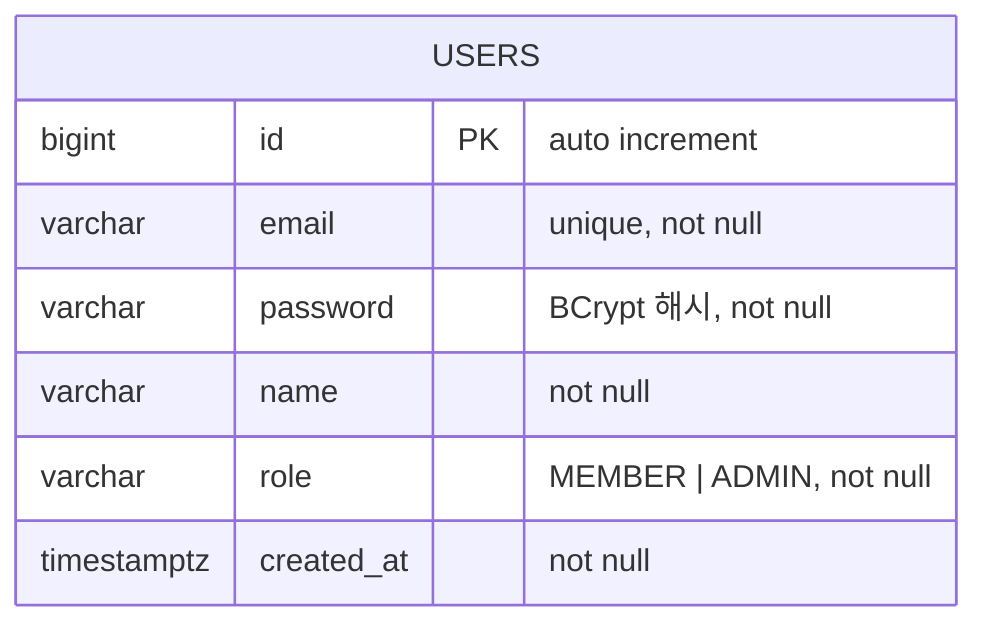

# ERD — 사용자 관리 및 인증

- **브랜치**: `feat/user-auth`
- **작성일**: 2026-07-14

---

## 다이어그램

---

## 테이블 정의

### users

| 컬럼 | DB 타입 | Kotlin 타입 | 제약 | 설명 |
|---|---|---|---|---|
| id | `BIGINT` | `Long` | PK, auto increment | 식별자 |
| email | `VARCHAR` | `String` | UNIQUE, NOT NULL | 로그인 ID |
| password | `VARCHAR` | `String` | NOT NULL | BCrypt 해시 값 |
| name | `VARCHAR` | `String` | NOT NULL | 사용자 이름 |
| role | `VARCHAR` | `Enum(MEMBER, ADMIN)` | NOT NULL, default `MEMBER` | 권한 |
| created_at | `TIMESTAMPTZ` | `ZonedDateTime` | NOT NULL | 가입 일시 |

---

## 인덱스

| 인덱스명 | 컬럼 | 종류 | 목적 |
|---|---|---|---|
| `users_pkey` | `id` | PK | 기본 조회 |
| `users_email_key` | `email` | UNIQUE | 중복 가입 방지, 로그인 조회 |

---

## 설계 결정 기록 (Decision Log)

| # | 질문 | 선택 | 선택지 후보 | 이유 |
|---|---|---|---|---|
| 1 | PK 타입 | `BIGINT` auto increment | ① Long auto increment ② UUID | UUID는 외부 노출 시 보안상 유리하나 인덱스 성능이 떨어짐. 시연 규모에서는 단순한 auto increment가 적합. 순번 추측 문제는 API 인가(JWT)로 방어. |
| 2 | role 저장 방식 | `VARCHAR` Enum 문자열 (`MEMBER` / `ADMIN`) | ① users 컬럼에 Enum 문자열 ② 별도 roles 테이블 분리 | 역할이 현재 2종류로 고정적이므로 별도 테이블은 과함. Enum 문자열로 저장해 조회 시 JOIN 없이 바로 확인 가능. |
| 3 | createdAt 타입 | `TIMESTAMPTZ` (timezone 포함) | ① `TIMESTAMP` (timezone 없음) ② `TIMESTAMPTZ` | 요구사항에 `timestampz`로 명시되어 있으며, 다국적 서비스 확장 시 시간대 정보 보존이 필요. |
