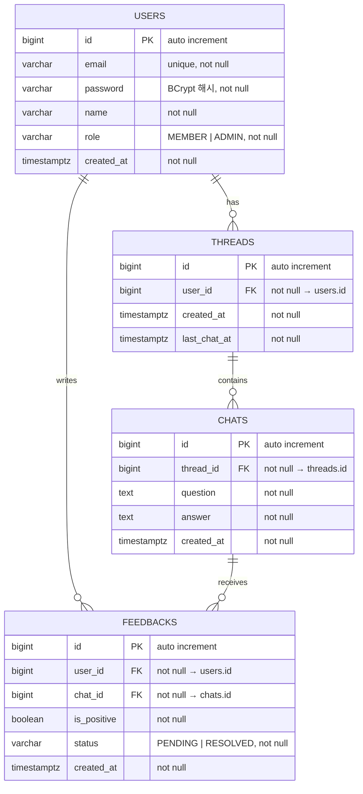

# ERD — 사용자 피드백(Feedback) 관리

- **브랜치**: `feat/feedback`
- **작성일**: 2026-07-14

---

## 다이어그램

> 피드백 대상 단위: `chats.id` (개별 Q&A 쌍). 사용자 확인 완료.

---

## 테이블 정의

### feedbacks

| 컬럼 | DB 타입 | Kotlin 타입 | 제약 | 설명 |
|---|---|---|---|---|
| id | `BIGINT` | `Long` | PK, auto increment | 식별자 |
| user_id | `BIGINT` | `Long` | NOT NULL, FK → users.id | 피드백 작성자 |
| chat_id | `BIGINT` | `Long` | NOT NULL, FK → chats.id | 피드백 대상 Chat (개별 Q&A 쌍) |
| is_positive | `BOOLEAN` | `Boolean` | NOT NULL | `true` = 긍정, `false` = 부정 |
| status | `VARCHAR` | `FeedbackStatus` (enum) | NOT NULL, DEFAULT 'PENDING' | 처리 상태 |
| created_at | `TIMESTAMPTZ` | `ZonedDateTime` | NOT NULL | 피드백 생성 일시 |

---

## 유니크 제약

| 제약명 | 컬럼 | 목적 |
|---|---|---|
| `feedbacks_user_chat_uq` | `(user_id, chat_id)` | 동일 사용자가 동일 대화에 피드백 중복 생성 방지 |

---

## 인덱스

| 인덱스명 | 테이블 | 컬럼 | 종류 | 목적 |
|---|---|---|---|---|
| `feedbacks_pkey` | feedbacks | `id` | PK | 기본 조회 |
| `feedbacks_user_id_idx` | feedbacks | `user_id` | INDEX | 사용자별 피드백 목록 조회 |
| `feedbacks_chat_id_idx` | feedbacks | `chat_id` | INDEX | 대화별 피드백 조회 |
| `feedbacks_created_at_idx` | feedbacks | `created_at` | INDEX | 생성일시 정렬 성능 |
| `feedbacks_user_chat_uq` | feedbacks | `(user_id, chat_id)` | UNIQUE INDEX | 중복 방지 |

---

## 설계 결정 기록 (Decision Log)

| # | 질문 | 선택 | 선택지 후보 | 이유 |
|---|---|---|---|---|
| 1 | 피드백 대상 FK | `chats.id` | ① `chats.id` ② `threads.id` | spec.md Decision Log #1 참조. 사용자 확인 완료. |
| 2 | 상태 컬럼 타입 | `VARCHAR` + enum 매핑 | ① VARCHAR ② SMALLINT | 기존 코드베이스(`UserRole`)와 동일 패턴 적용 |
| 3 | 코멘트(텍스트) 필드 추가 여부 | 미포함 | ① 없음 ② `TEXT comment` | 요청 명세에 텍스트 필드 미언급. 필요 시 추가. |
